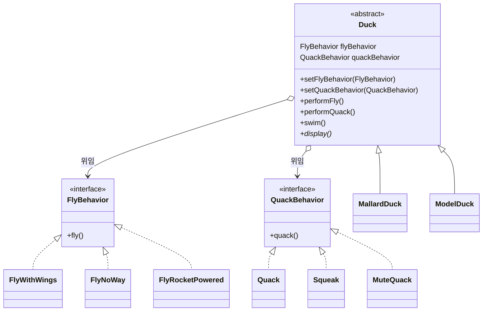

# Chapter 1. Strategy Pattern

오리 시뮬레이터(SimUDuck) 예제로 **전략 패턴**을 구현합니다.

행동이 오리 종류마다 다르고, 나중에 바뀔 수 있다면 상속으로 고정하지 말고 **알고리즘 군을 따로 캡슐화**한 뒤 조합해서 쓰라는 것이 이 장의 핵심입니다.

## 왜 상속만으로는 부족한가

처음에는 `Duck` 슈퍼클래스에 `quack()`, `swim()`, `fly()`를 두고 청둥오리·흰죽지오리 등이 상속받는 구조가 자연스러워 보입니다.

문제는 요구가 늘어날 때입니다.

- 고무 오리(`RubberDuck`)는 날면 안 되고, 소리는 삑삑거려야 한다.
- 가짜 오리(`DecoyDuck`)는 날지도, 소리 내지도 않아야 한다.
- 나중에 로켓으로 나는 오리처럼 **새로운 나는 방식**이 생긴다.

슈퍼클래스에 `fly()`를 넣으면 날면 안 되는 오리까지 날고, 서브클래스마다 오버라이드로 막는 방식은 종류가 늘수록 유지보수가 어려워집니다. `Flyable` 같은 인터페이스로 나누면 “누가 나는지”는 표현할 수 있지만, **나는 구현 코드가 여러 클래스에 중복**됩니다.

그래서 변하는 것(나는 방법, 소리 내는 방법)을 Duck 계층에서 **분리**합니다.

## 디자인 원칙

이 장이 강조하는 원칙은 세 가지입니다.

1. **변하는 부분을 찾아 변하지 않는 부분과 분리한다.**  
   `fly` / `quack`은 오리마다, 시점마다 달라지므로 Duck 안에서 빼낸다.
2. **구현이 아니라 인터페이스에 맞춰 프로그래밍한다.**  
   Duck은 `FlyWithWings`가 아니라 `FlyBehavior`에 위임한다.
3. **상속보다 구성(Composition)을 사용한다.**  
   “오리 **이다**(is-a)”로 행동을 물려받기보다, “오리 **가 행동 객체를 가진다**(has-a)”로 조합한다.

## 전략 패턴

전략 패턴은 **알고리즘 가족을 정의하고, 각각을 캡슐화하며, 서로 교체할 수 있게** 만듭니다. 클라이언트(여기서는 `Duck`)와 독립적으로 알고리즘을 바꿀 수 있습니다.

실행 중에도 setter로 전략을 갈아끼울 수 있습니다. `ModelDuck`이 처음엔 못 날다가 `FlyRocketPowered`로 바꾸는 장면이 그 예입니다.



`Duck`의 `performFly()` / `performQuack()`은 스스로 구현하지 않고, 들고 있는 전략 객체에게 일을 맡깁니다.

```java
public void performFly() {
    flyBehavior.fly();
}
```

공통 행동인 `swim()`과 오리마다 다른 모습인 `display()`만 Duck 계층에 남깁니다.

## 이 패키지의 클래스

| 역할 | 클래스 |
|------|--------|
| Context | `Duck` |
| 나는 전략 | `FlyBehavior` ← `FlyWithWings`, `FlyNoWay`, `FlyRocketPowered` |
| 소리 전략 | `QuackBehavior` ← `Quack`, `Squeak`, `MuteQuack` |
| 구체적인 오리 | `MallardDuck` (날고 꽥꽥), `ModelDuck` (처음엔 못 남) |
| 실행 | `MiniDuckSimulator`, `MiniDuckSimulator1` |

- `MallardDuck` 생성자에서 `FlyWithWings` + `Quack`을 조립합니다.
- `ModelDuck`은 `FlyNoWay` + `Quack`으로 시작해서, 시뮬레이터에서 `setFlyBehavior(new FlyRocketPowered())`로 나는 방식을 바꿉니다.

`Squeak`, `MuteQuack`은 고무 오리·가짜 오리 같은 확장을 위한 전략입니다. 이 패키지 시뮬레이터에서는 아직 해당 Duck 서브클래스를 만들지 않았습니다.

## 실행

IntelliJ 등에서 아래 클래스의 `main`을 실행합니다.

### `MiniDuckSimulator`

청둥오리만 꽥꽥 / 비행합니다.

```
Quack
I'm flying!!
```

### `MiniDuckSimulator1`

청둥오리 뒤에 모형 오리를 추가합니다. 모형 오리는 처음엔 못 날다가 `FlyRocketPowered`로 전략을 교체합니다.

```
Quack
I'm flying!!
I can't fly
I'm flying with a rocket!
```

모형 오리는 같은 `ModelDuck` 객체인데도, 상속을 바꾸지 않고 **전략만 교체**해서 행동이 달라집니다.
