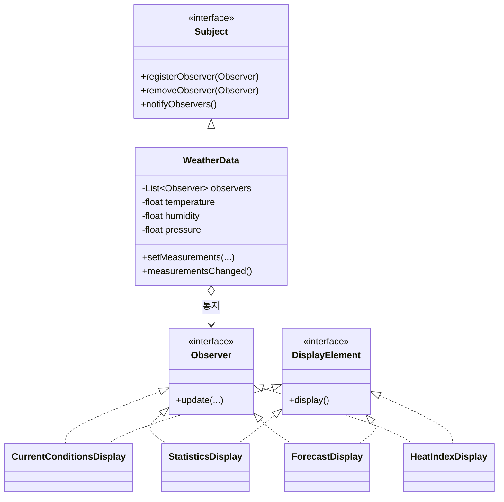

# Chapter 2. Observer Pattern

기상 스테이션(Weather Station) 예제로 **옵저버 패턴**을 구현합니다.

한 객체의 상태가 바뀌면, 그 객체에 의존하는 다른 객체들에게 **자동으로 알리고 갱신**해야 할 때 쓰는 패턴입니다. 디스플레이를 추가·제거해도 `WeatherData`를 고치지 않는 것이 이 장의 핵심입니다.

## 왜 디스플레이를 하드코딩하면 안 되는가

`WeatherData`가 온습도·기압을 갱신한 뒤 `measurementsChanged()`에서 현재 조건, 통계, 예보 화면을 **직접** 호출하면 처음엔 단순합니다.

문제는 요구가 늘어날 때입니다.

- 체감 온도(`HeatIndexDisplay`)처럼 **새 디스플레이**가 생긴다.
- 어떤 화면은 구독을 끊어야 한다.
- 화면마다 필요한 데이터가 다르다.

`WeatherData`가 구체 디스플레이를 알면, 화면이 바뀔 때마다 Subject 쪽 코드를 고쳐야 합니다. 그래서 “누가 구독하는지”를 **리스트로 두고, 인터페이스로만 통지**합니다.

## 디자인 원칙

이 장이 강조하는 원칙입니다.

- **서로 상호작용하는 객체 사이는 가능하면 느슨하게 결합한다.**  
  Subject는 Observer가 `update()`를 가진다는 것만 알고, 구체 클래스(현재 조건, 통계, 예보)는 모릅니다. Observer도 Subject의 구현 세부를 몰라도 구독·해지할 수 있습니다.

느슨한 결합이면 한쪽을 바꿔도 다른 쪽이 잘 깨지지 않습니다.

## 옵저버 패턴

옵저버 패턴은 **일대다(one-to-many) 의존 관계**를 정의합니다. 한 객체(Subject)의 상태가 바뀌면, 의존하는 모든 객체(Observer)가 알림을 받고 갱신됩니다.



`WeatherData`는 측정값이 바뀌면 구독자에게 위임합니다.

```java
public void measurementsChanged() {
    notifyObservers();
}
```

디스플레이는 생성자에서 스스로 구독합니다. `WeatherData`가 구체 화면을 new 하지 않습니다.

```java
public CurrentConditionsDisplay(WeatherData weatherData) {
    this.weatherData = weatherData;
    weatherData.registerObserver(this);
}
```

## Push vs Pull

같은 기상 스테이션을 두 가지 전달 방식으로 구현했습니다.

| | Push (`observer.weather`) | Pull (`observer.weather.pull`) |
|--|---------------------------|--------------------------------|
| `update` | `update(temperature, humidity, pressure)` | `update()` |
| 데이터 | Subject가 값을 **밀어 넣음** | Observer가 getter로 **당겨 옴** |
| getter | 주석 처리되어 있음 | `getTemperature()` 등 사용 |

Push는 Subject가 “무엇을 보낼지” 정합니다. 필드가 늘면 `update` 시그니처가 깨지기 쉽습니다.

Pull은 Observer가 “무엇을 쓸지” 정합니다. 이 패키지의 Pull 구현은 `update()`만 호출한 뒤 `weatherData.getTemperature()`처럼 필요한 값만 가져갑니다.

콘솔에 찍히는 문장은 Push/Pull이 같습니다. 차이는 **데이터가 오가는 방향**입니다.

## 이 패키지의 클래스

### `observer.weather` / `observer.weather.pull`

| 역할 | 클래스 |
|------|--------|
| Subject | `WeatherData` |
| Observer | `CurrentConditionsDisplay`, `StatisticsDisplay`, `ForecastDisplay`, `HeatIndexDisplay` |
| 실행 | `WeatherStationMain`, `WeatherStationWithHeatIndexMain` |

- 현재 조건: 온도·습도
- 통계: 평균/최고/최저 기온
- 예보: 기압 변화
- 체감 온도: 온도·습도로 heat index 계산

마지막 측정 전에 `removeObserver(forecastDisplay)`를 호출하므로, 그다음부터는 예보가 출력되지 않습니다. Subject를 수정하지 않고 **구독만 끊은** 예입니다.

### `observer.swing`

버튼 하나(`Should I do it?`)에 옵저버(리스너)를 여러 개 붙입니다. Subject는 Swing의 `JButton`입니다.

| 클래스 | 리스너 작성 방식 |
|--------|------------------|
| `SwingObserverExampleV1` | 내부 클래스 `AngelListener`, `DevilListener` |
| `SwingObserverExampleV2` | 익명 클래스 |
| `SwingObserverExampleV3` | 람다 |

버튼을 누르면 콘솔에 천사/악마 메시지가 함께 나옵니다. 한 Subject에 Observer가 여러 개인 구조가 GUI에도 그대로 쓰입니다.

## 실행

IntelliJ 등에서 아래 클래스의 `main`을 실행합니다.

### `observer.weather.WeatherStationMain`

현재 조건·통계·예보만 구독합니다. 네 번째 측정부터 예보를 구독 해제합니다.

```
Current conditions: 80.0F degrees and 65.0% humidity
Avg/Max/Min temperature = 80.0/80.0/80.0
Forecast: Improving weather on the way!
-----------------------------------------------------
Current conditions: 82.0F degrees and 70.0% humidity
Avg/Max/Min temperature = 81.0/82.0/80.0
Forecast: Watch out for cooler, rainy weather
-----------------------------------------------------
Current conditions: 78.0F degrees and 90.0% humidity
Avg/Max/Min temperature = 80.0/82.0/78.0
Forecast: More of the same
-----------------------------------------------------
Current conditions: 62.0F degrees and 90.0% humidity
Avg/Max/Min temperature = 75.5/82.0/62.0
-----------------------------------------------------
```

### `observer.weather.WeatherStationWithHeatIndexMain`

`HeatIndexDisplay`만 추가했습니다. `WeatherData`는 그대로입니다.

```
Current conditions: 80.0F degrees and 65.0% humidity
Avg/Max/Min temperature = 80.0/80.0/80.0
Forecast: Improving weather on the way!
Heat index is 82.95535
-----------------------------------------------------
Current conditions: 82.0F degrees and 70.0% humidity
Avg/Max/Min temperature = 81.0/82.0/80.0
Forecast: Watch out for cooler, rainy weather
Heat index is 86.90124
-----------------------------------------------------
Current conditions: 78.0F degrees and 90.0% humidity
Avg/Max/Min temperature = 80.0/82.0/78.0
Forecast: More of the same
Heat index is 83.64967
-----------------------------------------------------
Current conditions: 62.0F degrees and 90.0% humidity
Avg/Max/Min temperature = 75.5/82.0/62.0
Heat index is 79.89782
-----------------------------------------------------
```

### `observer.weather.pull.WeatherStationMain` / `WeatherStationWithHeatIndexMain`

위와 출력이 같습니다. `update()` 후 getter로 값을 가져가는 Pull 버전입니다.

### `observer.swing.SwingObserverExampleV1` ~ `V3`

창이 뜨고 버튼을 누르면 대략 아래가 출력됩니다.

```
Don't do it, you might regret it!
Come on, do it!
```

`V3`는 악마 쪽 문자열이 `Come on, dot it!`으로 되어 있습니다.
